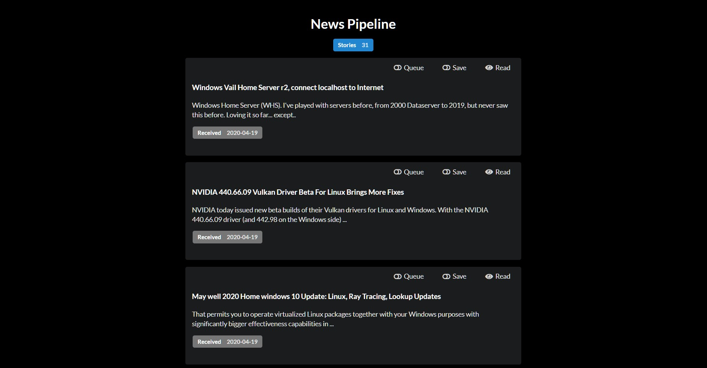

# Twitter News Pipeline

This project consumes [Google Search Alert](https://www.google.com/alerts) Emails (Yes, on port 25, as a read only mail server), and displays them on a web dashboard for easy reading, the articles can then be queued for posting on Twitter at a configured interval.

I threw this together over the course of a few days as a "Hackathon" style challenge, there is no authentication, although it could be added relatively easily.

It implements a micro-service infrastructure via Docker containers:

- db: A MongoDB instance
- ingress: Listens for incoming Emails from Google Search Alerts and stores the links and metadata to the database
  - I use my self-hosted Email server to forward these from Google to the application, might be tricky to set up the alerts with out using a real Email account to forward them, but I'm sure there's a way if you're clever
- api: Serves the data via GraphQL for the web front-end, and handles mutations
- web: GatsbyJS front-end served by NGINX, which also handles traffic routing to the API
- egress: Purges old articles, the max age and run interval are configurable.  Articles that have been marked "Saved" will not be purged.
- publisher: Handles submitting articles to Twitter

## Requirements

- Docker + compose
- A Twitter developer account ([Sign up here](https://developer.twitter.com), then create an App to get the four API keys needed)

## Configuration

Copy the `docker-compose.example.yml` file to `docker-compose.yml`, you'll need to edit this file before starting it up.

Add the four API keys from Twitter to `ACCESS_TOKEN`, `ACCESS_TOKEN_SECRET`, `API_KEY`, and `API_KEY_SECRET`.

The `publisher` and `egress` services both take in a `RUN_INTERVAL` option in the `cron` format ([Crontab Guru](https://crontab.guru/) is a very helpful tool for this).

Under `ingress`, the `ALLOW_IP`, `ALLOW_FROM`, and `ALLOW_TO` options will restrict what Emails the service will accept, they are optional, leaving them all blank will accept any Email.

*Note: The `web` service can also accept a `GATSBY_API_URL` environment variable that is useful for development, the default is `/graphql` since NGINX handles the routing.

Run `docker-compose up -d` to start everything up. (`docker-compose down` will stop it, and `docker-compose down --rmi local --volumes` will stop and purge the entire system included the data stored in the database).

If you're just checking it out, you can cd into the `ingress` directory after starting it up and run `npm install && node test` to send a dummy Email and get some articles into the database.
